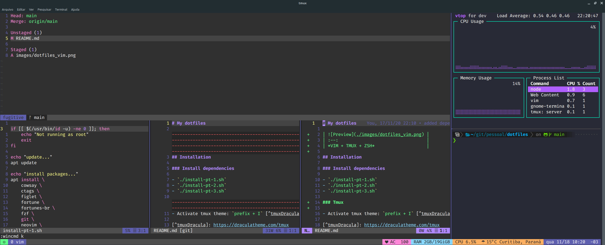

# My dotfiles

|  |
| :--:                               |
| *VIM + TMUX + ZSH*                 |

## Installation

### Install dependencies

- `./install-pt-1.sh`
- `./install-pt-2.sh`
- `./install-pt-3.sh`

### Tmux

- Activate tmux theme: `prefix + I` [^tmuxDracula]

[^tmuxDracula]: https://draculatheme.com/tmux

### NEO VIM

